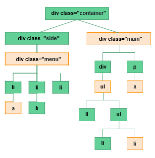

1. Create file inheritance.html with following code:
<body style=”color:red;”>
    

        

            
почему текст красного цвета?  
                <b> - почему эта часть выделена жирным?</b>
            

        

        

        

        
почему текст меньше и зеленого цвета?

    

</body>

2. Add external *.css file for inheritance.html. Add some random font from Google Fonts
3. Create selectors for highlighted elements from picture below

4. Create and style following structure:
    (
)Этот текст крупный (
)Этот текст красного цвета
    (
)Этот текст крупный и подчеркнутый (<h1>)Заголовок зеленого цвета
    (<ul>)(<li>)Элемент списка крупный и подчеркнутый (<li>)Элемент списка крупный и подчеркнутый
    (<li>)Элемент списка крупный, подчеркнутый и красного цвета (<li>)Элемент списка подчеркнутый
    